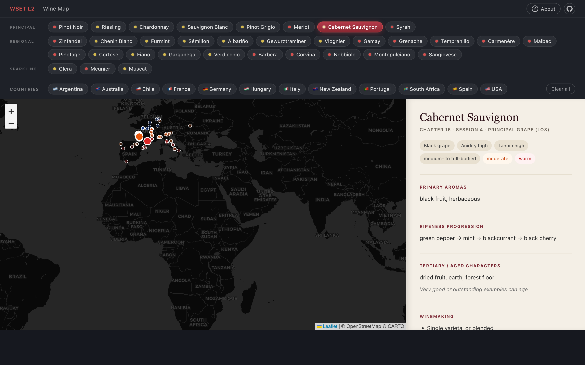

<div align="center">

# 🍇 terroir

**Interactive grape-centric study map for the WSET Level 2 Award in Wines.**

<a href="https://terroir.cc/">
  
</a>

[🌐 Live demo](https://terroir.cc/) · [📚 About WSET](#-about-wset)


</div>

---

Pick a grape variety to highlight every region in scope; pick a region to see what's grown there and how the grape expresses on that site. Built as a personal study tool to memorise grape ↔ region pairings (~62% of the L2 exam).

## ✨ Features

- 🎯 **Compose filters** — pick a grape *and* a country; the map narrows to regions that match both.
- 🌡️ **Climate-coloured pins** — cool / moderate / warm at a glance.
- 📋 **Grape detail** — characteristics, primary aromas, ripeness ladder, winemaking notes, regions in scope, and per-region style notes.
- 📍 **Region detail** — every grape grown there with the per-pairing style note.
- 🌍 **Country roll-up** — all regions in a country plus its principal/regional grapes.
- 📱 **Mobile-friendly** — stacked layout for phones with auto-scroll on selection.

## 🚀 Run locally

No build step. Static files only.

```bash
python3 -m http.server 8080
```

Then open <http://localhost:8080>.

## 🛠️ Stack

- **Vanilla HTML / CSS / JS** in a single `index.html`.
- **Leaflet** for the map (loaded via CDN).
- **CartoDB Dark Matter** tiles for the basemap.
- **Hand-curated JSON** as the data store — no DB, no build, no framework.

## 📊 Data files

All under `data/`:

| File | Count | What it is |
| --- | --- | --- |
| `grapes.json` | 33 | Grape varieties in WSET L2 scope (LO3 principal, LO4 regional, LO5 sparkling) |
| `regions.json` | 125 | Countries, regions, sub-regions, and appellations in scope |
| `labelTerms.json` | 45 | Label-vocabulary terms (AOC, Riserva, Fino, Brut, etc.) |
| `types.ts` | — | TypeScript schema documenting the data shape |

`types.ts` is reference documentation, not compiled. The JSON files are the source of truth.

### 🔗 Cross-references

- A grape's `regions[]` is the canonical list of GIs it's grown in.
- A region's `principalGrapes[]` / `regionalGrapes[]` lists grapes by syllabus category.
- A grape's `styleByRegion[<regionId>]` gives the per-pairing style note (e.g. Cabernet Sauvignon in Pauillac vs. Coonawarra). This is where most of the exam-relevant content lives.
- A region's `labelTerms[]` references entries in `labelTerms.json`.

When adding a new grape or region, update **both sides** so the cross-links stay intact.

## 📚 About WSET

> [!NOTE]
> The [**WSET Level 2 Award in Wines**](https://www.wsetglobal.com/qualifications/wset-level-2-award-in-wines/) is a globally recognised wine qualification covering grape varieties, key regions, label terms, and tasting vocabulary. The exam is heavily weighted toward grape ↔ region associations — hence this map.

## 📝 Sources & caveats

- Primary source: WSET Level 2 official spec and lesson PDFs (L2E01–L2E07).
- Some self-study grapes (e.g. Gewürztraminer, Viognier, Pinotage) were drafted from <https://wset.luksow.com/> and verified against the textbook; minor corrections have been folded in.
- A few fortified regions (Sherry, Douro/Port) describe their grapes in `styleNotes` rather than seeding them as standalone grape entries, since Palomino / Touriga Nacional etc. aren't in the LO3/LO4 grape lists.

## 🚧 Status

Reference mode only — no quiz mode yet.

## ⚖️ License

- **Code** (`index.html` + any future source files): [MIT](LICENSE).
- **Data** (`data/*.json`): study notes derived from copyrighted WSET Level 2 materials and not licensed for redistribution. Use as a personal study reference; verify against the original WSET sources for anything authoritative.
- This project is **not affiliated with or endorsed by WSET**.
